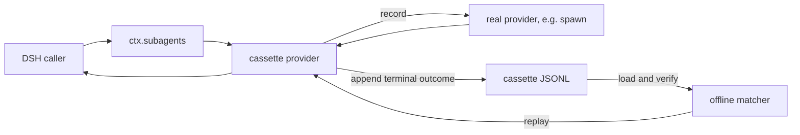

# Architecture

This document describes the implemented `0.1.0` architecture. The compatibility target is the one-shot provider contract in `@deepseek-ai/dsh-subagent@0.1.0-rc.7`.

## Boundary and ownership

The plugin adds a provider named `cassette` by default. It does not intercept the provider registry globally and does not replace `spawn` or another real provider. A call is recorded or replayed only when its descriptor selects the cassette provider.



The DSH one-shot ownership contract is preserved:

1. Before `start()` fulfills, the provider owns unpublished startup resources.
2. After fulfillment, the caller owns the returned `SubagentRun` and must dispose it.
3. `SubagentRun.result` carries the terminal result or a post-publication infrastructure rejection.

The recorder wraps that lifecycle rather than inventing a second run model.

## Record path

`installCassette()` performs these operations in record mode:

1. Validate provider names and find the registered upstream provider.
2. Resolve the output path and create a versioned header.
3. Open a `CassetteWriter` in `create`, `truncate`, or `append` mode.
4. Construct `RecordingSubagentProvider` and compile custom redaction patterns.
5. Register the cassette provider.

For every admitted `start()` call, the recorder:

1. Maps the live parent to a stable topology key.
2. Snapshots the observable parent context and computes its canonical fingerprint.
3. Snapshots and normalizes the request, then computes its canonical request fingerprint.
4. Reserves a per-group occurrence and a globally unique sequence number.
5. Builds either the metadata request view or the redacted full request view.
6. Calls the upstream provider with the original request.
7. Observes the returned run's result, abort signal, and disposal.
8. Snapshots and redacts the terminal result or error facts.
9. Serializes one interaction through the append queue.

The original successful result snapshot is returned to the live caller. Redaction affects the persisted copy, not the record-mode caller's value.

### Failure points

An upstream `start()` rejection is recorded as `start-error`, with `published: false`. A rejection of an already published run's `result` is recorded as `result-error`, with `published: true`. A successful `SubagentResult` is recorded as `result`.

If a successful result cannot be represented as lossless plain JSON, snapshotting fails and the recorder persists that failure as a `result-error`. If persistence itself fails, the write failure becomes observable to the wrapped result or start path.

### Completion order and physical order

`sequence` is reserved when the call is admitted. The line is appended only when that call reaches a terminal boundary. Concurrent calls can therefore appear in physical completion order while carrying a different sequence order.

The writer serializes concurrent append operations and chains hashes in physical file order. An exclusive cross-process lock prevents a second library writer from forking the chain. Consumers must not infer completion order from `sequence`, or admission order from line position.

### Shutdown

Record-mode disposal first unregisters the provider, preventing new starts. It then waits for every already admitted start to persist a terminal outcome before syncing and closing the file. Disposal can wait indefinitely if an admitted upstream run never settles and is never otherwise cancelled; the plugin does not seize ownership from the run's caller.

## Stable topology

Volatile Agent and Session ids are not stored as match identities. `TopologyTracker` maps the first non-subagent parent to `root`. A local child exposed by an upstream run can be mapped to that run's `callKey`, producing paths such as:

```text
root
root/audit-5d663a77f142~1
root/audit-5d663a77f142~1/check-api-133f54e3e03a~1
```

A call key contains:

```text
<parent-key>/<readable-label>-<combined-identity-prefix>~<occurrence>
```

The readable label and 12-hex prefix of the combined parent-context/request identity are diagnostic only. Matching uses the full parent key, parent-context fingerprint, and request fingerprint.

The recorder rejects:

- more than one live top-level parent in one provider lifetime;
- a subagent-origin parent that was not registered as a local child through this cassette provider;
- attempts to map one child id to two call keys.

This makes missing topology information explicit instead of silently falling back to volatile ids.

### Nested-call limit

Nested mapping is useful while recording and for inspecting provenance. Replay intentionally returns no `localAgent` and does not execute the recorded local child. Consequently, this version is best used at the selected one-shot boundary of a scenario, rather than as a recursive simulator expected to recreate and consume an entire nested local tree.

## Request identity

Before request matching, `normalizeParentContext()` snapshots the parent state used by DSH's official in-process child path:

```text
Agent options
stable session cwd, origin, delegationDepth, and agentPreset
live composed preset and delegated sandbox/approval facts, when available
completed-turn model-visible messages and the prefix's latest system/tools, only when inheritsParentContext is true
```

The completed prefix follows the official fork boundary: every event through the last `turn/end`, excluding the current unbalanced turn. The canonical session surface is folded and projected to messages. Volatile message ids are removed, while tool-call ids and their result correlations are renumbered by first structural occurrence. This allows equivalent history in a newly minted Session to match without weakening message content or ordering.

The resulting SHA-256 value is `parentContextFingerprint`. It is deliberately conservative: changes in workspace, route, composition, or delegated policy fail matching; for an inheriting provider, changes in tools, system text, or completed history fail as well. A third-party provider may depend on additional Cordis or external state that the provider boundary cannot enumerate. Such dependencies remain outside the guarantee and must be controlled by the test environment.

`normalizeRequest()` snapshots these stable request fields:

```text
label, prompt, agentOptions, outputSchema, maxDepth, toolFilter, persona
```

Undefined optional fields are omitted. The abort signal, parent object, and descriptor are excluded. The snapshot must be lossless plain JSON. Canonical serialization sorts object keys and preserves array order; SHA-256 over that string becomes `requestFingerprint`.

Request identity is strict. Changes in prompt whitespace, content block order, options, schema, depth, filter, persona, or label can produce a mismatch. There is no semantic fallback.

## Concurrent matching and duplicates

Replay groups interactions by:

```text
parentKey + NUL + parentContextFingerprint + NUL + requestFingerprint
```

Each group is ordered by `occurrence`. Matching removes the next interaction from the exact group, independently of the order in which other sibling groups are requested. This is why distinct concurrent sibling requests can reverse replay order safely.

Identical requests under one parent context share a group. If that group has more than one recorded interaction and their canonical outcomes differ, its intended mapping cannot be inferred from request data alone. The default `duplicatePolicy: reject` fails while constructing the matcher. `duplicatePolicy: sequence` explicitly chooses occurrence order. It should be used only when the caller can guarantee the same duplicate start order.

Stable, request-distinguishing labels or prompt fields are preferable to the sequence policy.

## Replay path

`installCassette()` performs these operations in replay mode:

1. Resolve, read, parse, and validate the complete available cassette.
2. Validate exact schema and DSH target versions and the hash chain.
3. Reject ambiguous duplicate groups unless sequence policy is explicit.
4. Reject successful outcomes with redaction substitutions unless explicitly allowed.
5. Construct a matcher and register `ReplaySubagentProvider`.

No upstream provider is looked up. The replay provider exposes the capabilities and `inheritsParentContext` facts captured in the header so the DSH service performs the same start-time capability checks.

On `start()`, the matcher consumes one exact interaction. Replay optionally waits for recorded start latency. A recorded startup error rejects before returning a run. Otherwise it returns a synthetic run id, no local Agent, and a promise for the recorded successful outcome or post-publication error.

Successful results are detached again before delivery. Recorded errors become `CassetteRecordedError`; the recorded error name is available as `recordedName` and its string code is preserved.

### Timing and cancellation

With `timing: instant`, both delay components are zero. With `timing: recorded`, replay uses:

```text
start delay = startLatencyMs / speed
result delay = (durationMs - startLatencyMs) / speed
```

An already-aborted signal, or an abort during start delay, rejects publication. An abort after publication, or explicit run disposal, resolves the result as an aborted `SubagentResult`. These are live replay controls; replay does not force the original recording's abort moment to recur.

## Consumption assertion

Every matched interaction is marked consumed. `CassetteHandle.assertConsumed()` checks immediately, and replay-mode disposal performs the same check by default after unregistering the provider. This catches a scenario that made fewer exact calls than the cassette contains.

Set `assertConsumed: false` only when partial replay is intentional. Extra live calls always fail at match time regardless of this option.

## Component map

| Module | Responsibility |
|---|---|
| `src/index.ts` | Cordis schema, plugin entry point, installation, registration, and teardown. |
| `src/provider.ts` | Recording and offline replay provider lifecycle. |
| `src/topology.ts` | Stable parent paths, occurrence reservation, strict matching, consumption checks. |
| `src/canonical.ts` | Lossless parent/request/result snapshots, volatile-id normalization, canonical JSON, metadata, and SHA-256 fingerprints. |
| `src/redact.ts` | Built-in and configurable persistence redaction. |
| `src/format.ts` | Versioned JSONL parsing, validation, hash chain, append writer, summaries. |
| `src/cli.ts` | Metadata-only `verify` and `inspect` commands. |
| `src/errors.ts` | Stable cassette error classes and codes. |

## Deliberate extension points

- The public `installCassette()` API supports programmatic Cordis composition.
- `dsh-subagent-cassette/format` exports the parser, writer, and summary APIs for trusted tooling.
- Provider and file names are configurable, so independent cassettes can coexist in one deployment if they use distinct provider registrations.

Adding continuable behavior, authenticated manifests, or a trailer commit would change ownership or format semantics and should be designed as an explicit versioned feature rather than inferred from the current API.
